# T3A2 Part B (and Part A)

------

**CMP1043 - Introduction to Software Engineering**

**PRG1006 - Programming II**

------

*React-Rails Web App, developed by Ji, Sajith, Daniel Kim*

------

## R4 |	Demonstrate Ability to Work in Team

### 	Kanban board

​		https://trello.com/b/56p7isHM/t3a2-gold-label

### 	Git source control

​		https://github.com/jacinyan/gl-frontend/graphs/contributors

​		https://github.com/jacinyan/gl-backend/graphs/contributors

------

**Below - Kanban board for Part B of assignment**

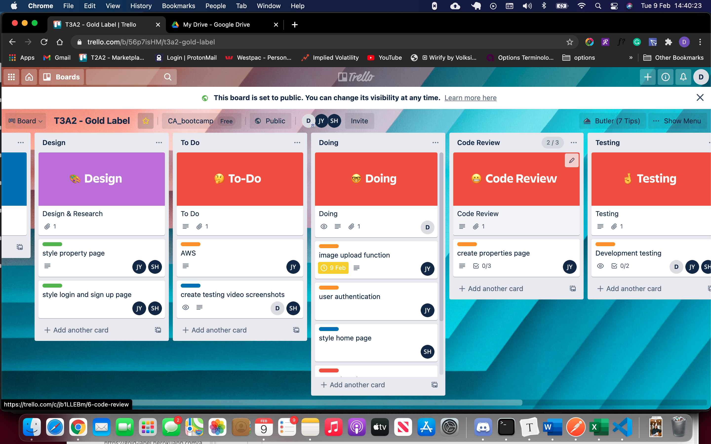

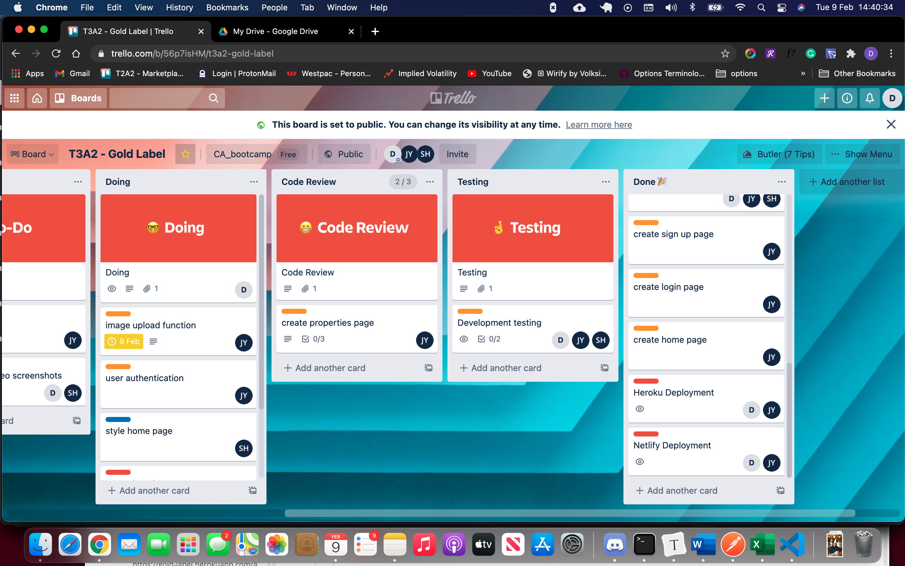

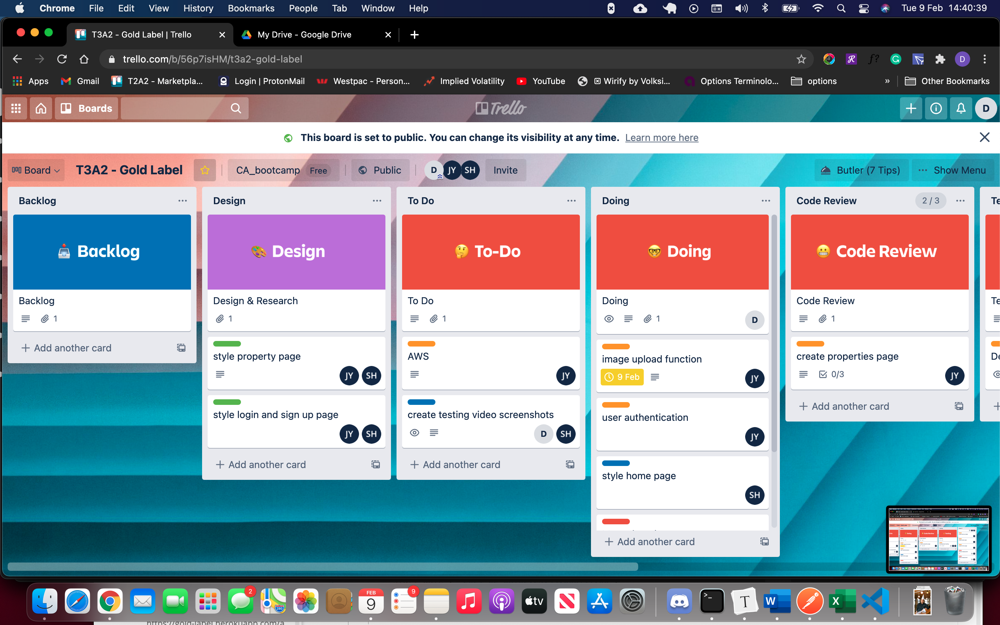

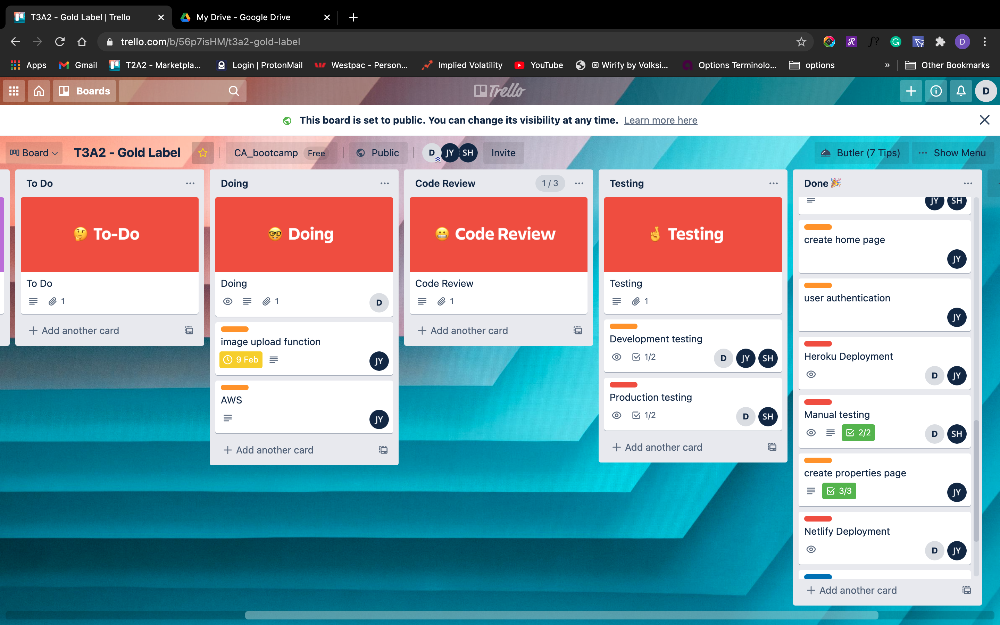

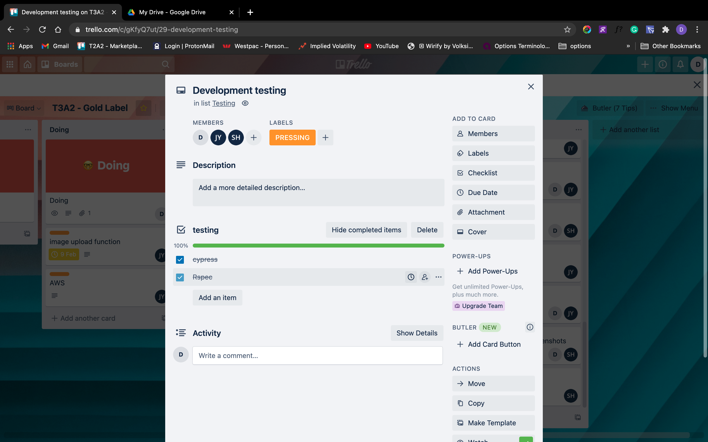

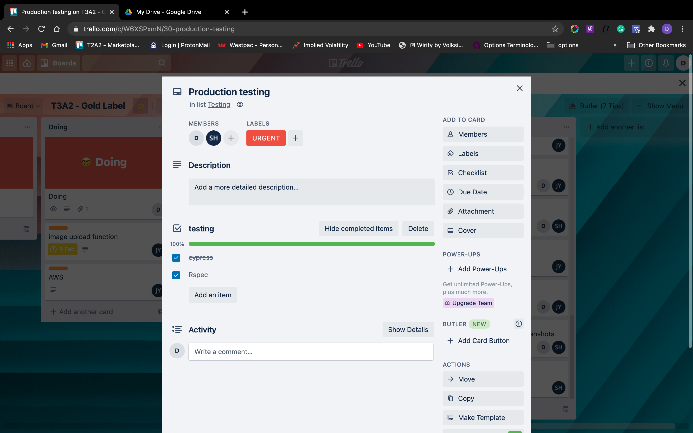

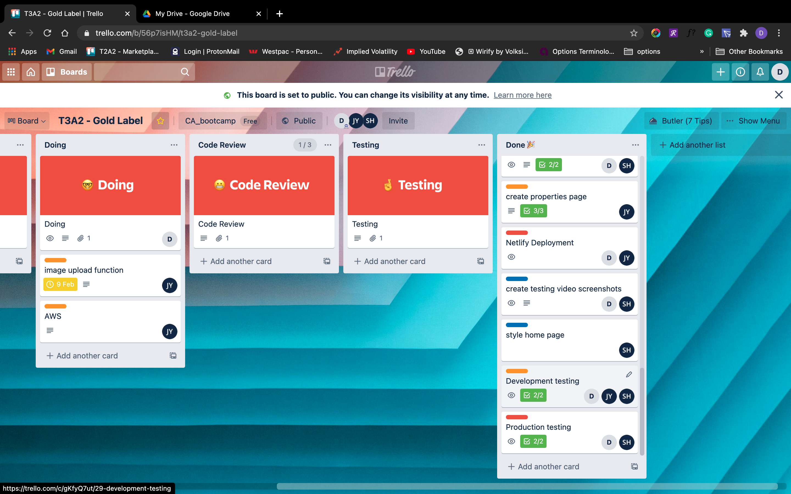

## R5 |	Produce a Working Application That Meets Client and User Needs

*Please see app*.

## R6 |	Deploy App to a Cloud Hosting Service

*Deployed. Please check R10 below*.

## R7 |	Produce an Application With an Intuitive User Interface

*Please see app*.

## R8 |	Evidence of User Testing

### <u>Screen Recordings</u>

### 	Development Side

​		https://drive.google.com/file/d/1LeJbLP9OCkmA5UpXrOlpqeUeWT_dr17B/view?usp=sharing

### 	Production Side

​		https://drive.google.com/file/d/1kQm2kghjjNt60fZGjlPuoqnQ3BwqZu-z/view?usp=sharing

------

### 	8.1 |	Development Enviroment - Desktop

| TYPE         | TASK                                           | OUTCOME | COMMENTS                                                     |
| ------------ | ---------------------------------------------- | ------- | ------------------------------------------------------------ |
| authenticate | user can sign up                               | pass    | directed straight to landing page after suscceful sign up.   |
| authenticate | user can login                                 | pass    | green popup welcome message                                  |
| authenticate | user can log out                               | pass    | user is prompted to the login page                           |
| authenticate | testing user details                           | pass    | when incorrect details entered, error message is shown to user. |
| bookings     | user can select date to make booking           | pass    | booking is confirmed with green pop up message.              |
| bookings     | user can view bookings                         | pass    | user has option to confirm booking via button toward the right side of table. |
| bookings     | user can confirm booking                       | fail    | booking detials dissapear after selecting confirm button. Not sure if that is a sign of an actual confirmation or bug. |
| bookings     | select arrival time and date                   | pass    |                                                              |
| bookings     | payment system                                 | fail    | option to pay is there, however payment button does not work or direct to a payment page. Subtotal for final price is incorrect. |
| client       | user can enter contact details                 | n/a     | unable to be implemented                                     |
| client       | user can update contact details                | fail    | my profile navigation does not work as intended. Goes to landing page instead. |
| client       | user can navigate to their bookings page       | pass    |                                                              |
| search       | user can search for properties                 | pass    | user can search for properties, however there are no images uploaded to show. |
| search       | user can filter based on categories            | pass    |                                                              |
| search       | user can find detailed view of properties      | pass    |                                                              |
| search       | search bar                                     | 50/50   | search bar works, but exact name of item needs to be written otherwise nothing shows up, not even related items. |
| contact      | user can send feedback form                    | n/a     |                                                              |
| contact      | contact form viewable                          | n/a     |                                                              |
| contact      | contact socials viewable                       | n/a     |                                                              |
| admin        | admin can add property details                 | pass    |                                                              |
| admin        | admin can sign up                              | pass    |                                                              |
| admin        | admin can log in                               | pass    |                                                              |
| admin        | admin can upload and view photos of properties | fail    | image uploaded but cannot fetch                              |

### 8.1.1 |	Development Enviroment - Mobile/Tablet

| TYPE         | TASK                                           | OUTCOME | COMMENTS                                                     |
| ------------ | ---------------------------------------------- | ------- | ------------------------------------------------------------ |
| authenticate | user can sign up                               | pass    | directed straight to landing page after successful sign up. Landing page has some formatiing issues with background video/image, not being full screen and leaving whitespace. |
| authenticate | user can login                                 | pass    | green popup welcome message.                                 |
| authenticate | user can log out                               | pass    | user is prompted to the login page.                          |
| authenticate | testing user details                           | pass    | when incorrect details entered, error message is shown to user. |
| bookings     | user can select date to make booking           | pass    | booking is confirmed with green message.                     |
| bookings     | user can view bookings                         | pass    | not mobile friendly.                                         |
| bookings     | user can confirm booking                       | fail    |                                                              |
| bookings     | select arrival time and date                   | pass    |                                                              |
| bookings     | payment system                                 | 50/50   | screen freezes after pressing confirm button                 |
| client       | user can enter contact details                 | n/a     | unabale to be implemented                                    |
| client       | user can update contact details                | fail    | my profile navigation does not work as intended.             |
| client       | user can navigate to their bookings page       | pass    | however not mobile friendly.                                 |
| search       | user can search for properties - search bar    | 50/50   | search bar works, but exact name of item needs to be written otherwise nothing shows up, not even related items. |
| search       | user can filter based on categories            | pass    |                                                              |
| search       | user can find detailed view of properties      | pass    |                                                              |
| contact      | user can send feedback form                    | n/a     |                                                              |
| contact      | contact form viewable                          | n/a     |                                                              |
| contact      | contact socials viewable                       | n/a     |                                                              |
| admin        | admin can add property details                 | fail    |                                                              |
| admin        | admin can sign up                              | fail    |                                                              |
| admin        | admin can log in                               | fail    |                                                              |
| admin        | admin can upload and view photos of properties | fail    | image uploaded but cannot fetch                              |

### 	8.2 |	Production Enviroment - Desktop

| TYPE         | TASK                                           | OUTCOME | COMMENTS                                                     |
| ------------ | ---------------------------------------------- | ------- | ------------------------------------------------------------ |
| authenticate | user can sign up                               | pass    | directed straight to landing page after suscceful sign up.   |
| authenticate | user can login                                 | pass    | green popup welcome message                                  |
| authenticate | user can log out                               | pass    | user is prompted to the login page                           |
| authenticate | testing user details                           | pass    | when incorrect details entered, error message is shown to user. |
| bookings     | user can select date to make booking           | pass    |                                                              |
| bookings     | user can view bookings                         | pass    |                                                              |
| bookings     | user can confirm booking                       | pass    |                                                              |
| bookings     | select arrival time and date                   | pass    |                                                              |
| bookings     | payment system                                 | pass    | prompt for credit card details                               |
| client       | user can enter contact details                 | n/a     | unabale to be implemented                                    |
| client       | user can update contact details                | fail    | my profile navigation does not work as intended. Goes to landing page instead. |
| client       | user can navigate to their bookings page       | pass    |                                                              |
| search       | user can search for properties                 | pass    |                                                              |
| search       | user can filter based on categories            | pass    |                                                              |
| search       | user can find detailed view of properties      | pass    |                                                              |
| search       | search bar                                     | 50/50   |                                                              |
| contact      | user can send feedback form                    | n/a     |                                                              |
| contact      | contact form viewable                          | n/a     |                                                              |
| contact      | contact socials viewable                       | n/a     |                                                              |
| admin        | admin can add property details                 | pass    |                                                              |
| admin        | admin can sign up                              | pass    |                                                              |
| admin        | admin can log in                               | pass    |                                                              |
| admin        | admin can upload and view photos of properties | Pass    |                                                              |

### 8.2.1 |	Production Enviroment - Mobile/ Tablet

| TYPE         | TASK                                           | OUTCOME | COMMENTS                                                     |
| ------------ | ---------------------------------------------- | ------- | ------------------------------------------------------------ |
| authenticate | user can sign up                               | pass    | directed straight to landing page after successful sign up. Landing page has some formatiing issues with background video/image. |
| authenticate | user can login                                 | pass    | green popup welcome message.                                 |
| authenticate | user can log out                               | pass    | user is prompted to the login page.                          |
| authenticate | testing user details                           | pass    | when incorrect details entered, error message is shown to user. |
| bookings     | user can select date to make booking           | pass    | booking is confirmed with green message.                     |
| bookings     | user can view bookings                         | pass    | not mobile friendly.                                         |
| bookings     | user can confirm booking                       | pass    | formating is not mobile friendly.                            |
| bookings     | select arrival time and date                   | pass    |                                                              |
| bookings     | payment system                                 | pass    | credit card details prompted for user                        |
| client       | user can enter contact details                 | n/a     | unabale to be implemented                                    |
| client       | user can update contact details                | fail    | my profile navigation does not work as intended. Goes to landing page instead. |
| client       | user can navigate to their bookings page       | pass    |                                                              |
| search       | user can search for properties - search bar    | 50/50   | search bar works, but exact name of item needs to be written otherwise nothing shows up, not even related items. |
| search       | user can filter based on categories            | pass    |                                                              |
| search       | user can find detailed view of properties      | pass    |                                                              |
| contact      | user can send feedback form                    | n/a     |                                                              |
| contact      | contact form viewable                          | n/a     |                                                              |
| contact      | contact socials viewable                       | n/a     |                                                              |
| admin        | admin can add property details                 | pass    |                                                              |
| admin        | admin can sign up                              | pass    |                                                              |
| admin        | admin can log in                               | pass    |                                                              |
| admin        | admin can upload and view photos of properties | pass    |                                                              |

## R9 |	Utilises a Formal Testing Framework

*Please see app for Cypress and Rsepc testing files.* 

## R10 | 	A Link (URL) to Deployed Website

### 	Netlify

​		https://goldlabel.netlify.app/

### 	Heroku

​		https://goldlabel-api.herokuapp.com/api/properties

## R11 | 	 GitHub repository

### 	Master

​		https://github.com/jacinyan/gl-frontend

​		https://github.com/jacinyan/gl-backend

------

## R12 |	The contents of your `README.md` as submitted for `Full Stack App - Part A`

*Please see below - Part A*

------

## R1 |	Overview

### 		Purpose

We have selected to create an app - named Gold Label - for our client Ania. Ania is a property manager and owner, who privately manages her extensive portfolio of residential properties which spans across Australia and the globe. For this assignment, our web app will be based particularly around her Central Coast properties. Gold Label will facilitate as a digital hiring/booking interface, for interested parties looking to host their next function, whether that may be a wedding, corporate event, or birthday. Essentially a digital portfolio where Ania can advertise her properties, and where people can book and hire those properties. 

### 		Functionality | Features

- Allow interested parties to view her properties online, as potential venues for their next event.

- Allow the users to select desired property and book online.

- A landing page that includes an about us, contact - where only the contact details are statically displayed for simplicity - and socials. 

- Image upload for our client to add new properties.

- A My Bookings page, where users are displayed within a page what they have booked.

- Dropdown menu in "properties" tab so users have ease in being directed to properties that suit their event ie. Weddings, Corporate and Birthdays. 

  

  ### 	Target Audience

Two main target audiences that Gold Label will be intended for. The first is for interested parties that are looking for a venue to host an event in the Central Coast, whether are expectant newlyweds, companies and work-forces, and anyone else looking for a place to celebrate their birthday. The latter - and smaller - target audience will be Ania and her internal administration team for the app.

### 		Tech Stack		

| Technologies        |                   |
| ------------------- | ----------------- |
| **Front-end**:      | React, bootstrap  |
| **Back-end**:       | Rails, PostgreSQL |
| **Deployment**:     | Heroku, Netlify   |
| **Active Storage**: | Amazon S3, AWS    |

## R2 |	Dataflow Diagram

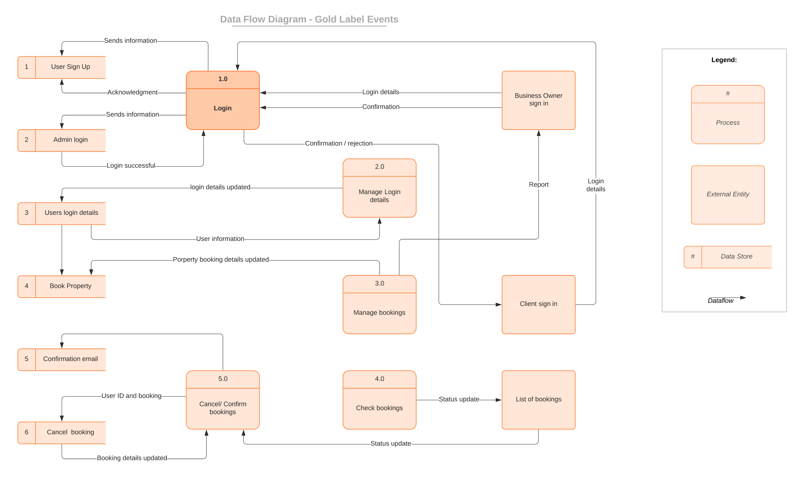

## R3 |	Application Architecture Diagram

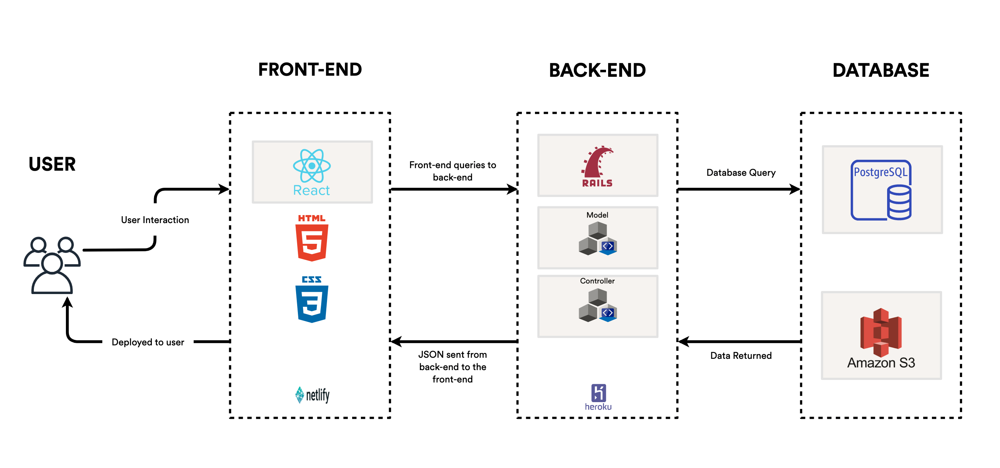

## R4 |	User Stories

We started our user's stories by brainstorming personas, and then in no particular order, wrote down said user stories as they came to mind, then we elaborated further on the ideas and then structure them in a way so that it made logical sense and then proceeded to reorder the user stories into their respective section under "users" and "business owner".

### 		Users

As a user, I would like to see which properties have been booked, so that I know what's available.

As a user, I would like to view different categories of events, so that I may select the most appropriate property for my event.

As a user, I would like to be able to cancel bookings and receive a cancellation confirmation email.

As a user, I would like to know information about the properties, in order to see if they meet my needs.

As a user, I would like to make an account in order to keep track of my current bookings.

As a user, I would like to leave reviews of past events I had at the properties.

As a user, I want to be able to contact the venue owner, in order to make inquiries about the advertised properties for my future event. 	

### 		Business Owner

As a business owner, I want to be able to upload images of my properties, so that users can browse and view potential venues for their event.

As a business owner, I would like to edit and delete my listings, to make sure everything is always up to date as to not confuse potential customers.

As a business owner, I would like to display venue availability, so that I know which properties to prepare.

As a business owner, I would want to meet the needs of potential customers according to the type of events they would host.

As a business owner, I would like potential customers to have access to my contact details, so that they can reach out to me regarding my properties. 

As a business owner, I would like to receive confirmation of client bookings of my properties, so that I can prepare the property to be ready by the expected time.

As a business owner, I would like to be able to respond to reviews left by my (past) clients.

As a business owner, I would like to blank out listings that have been booked by other clients, so that other clients don't double book venues.

## R5 |	Wireframes - Desktop | Mobile | Tablet

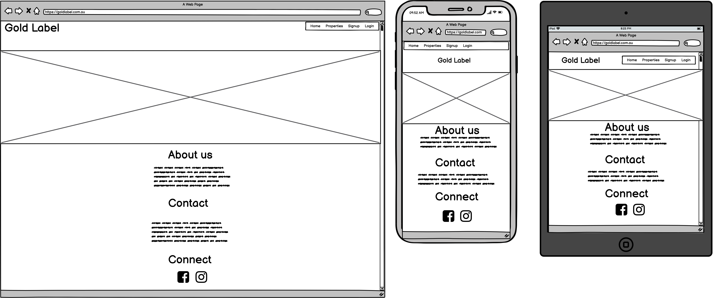

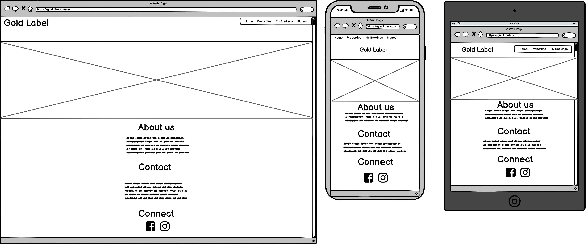

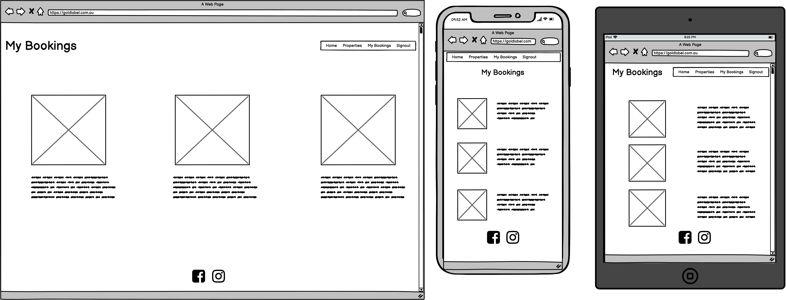

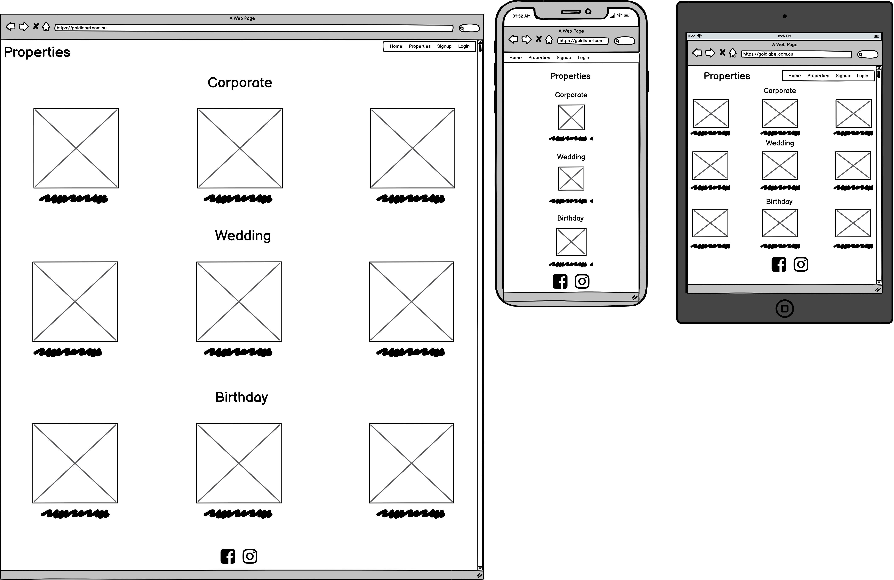

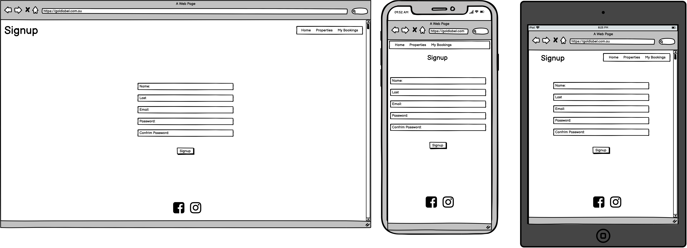

## R6 |	Trello Screenshots

[Kanban Board for T3A2](https://trello.com/b/56p7isHM/t3a2)

As you scroll down through the array of screenshots, our methodology approach for this part of the project becomes evident. 

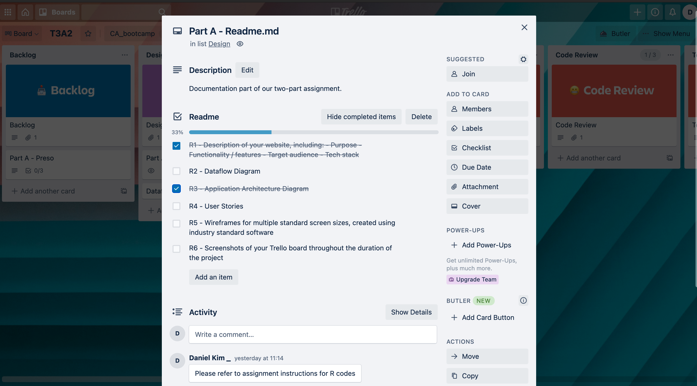

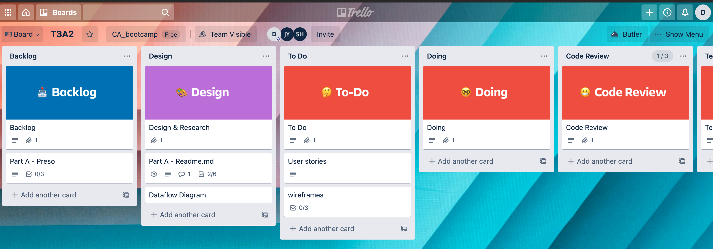

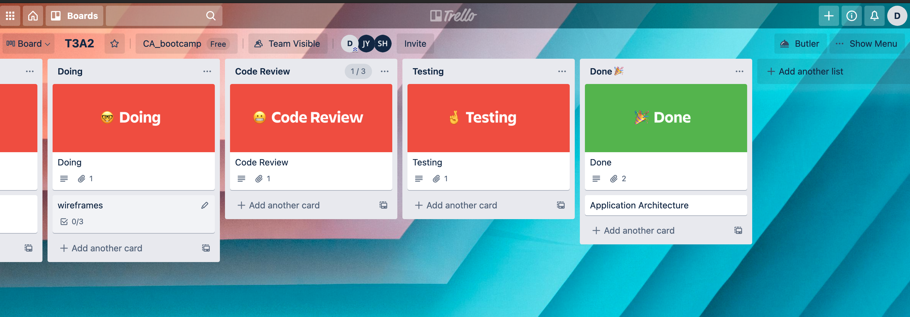

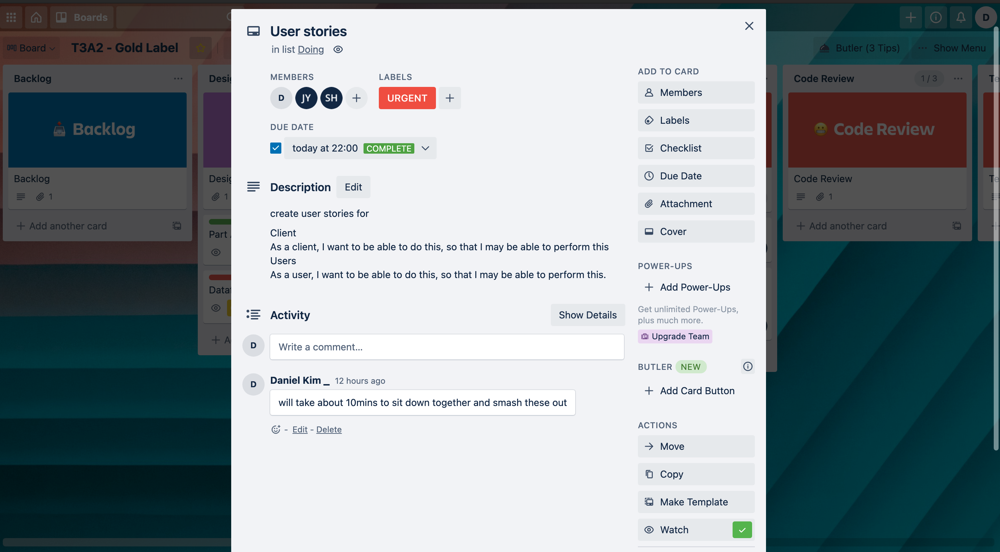

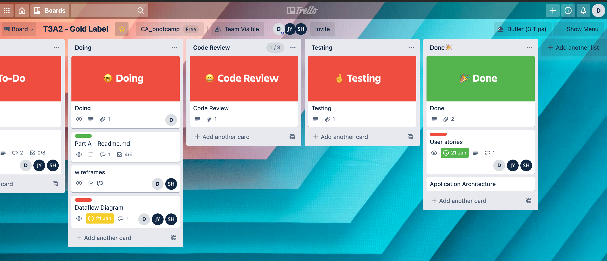

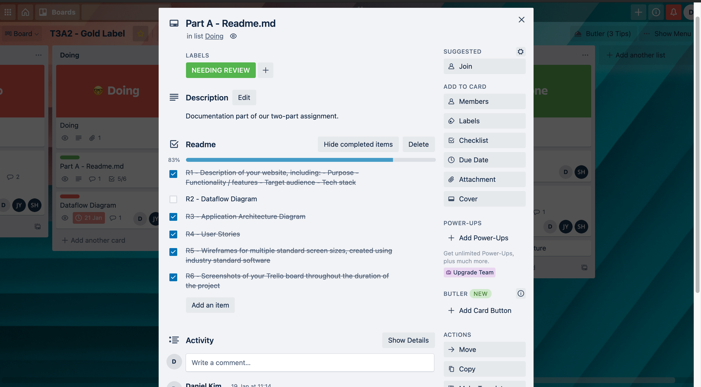

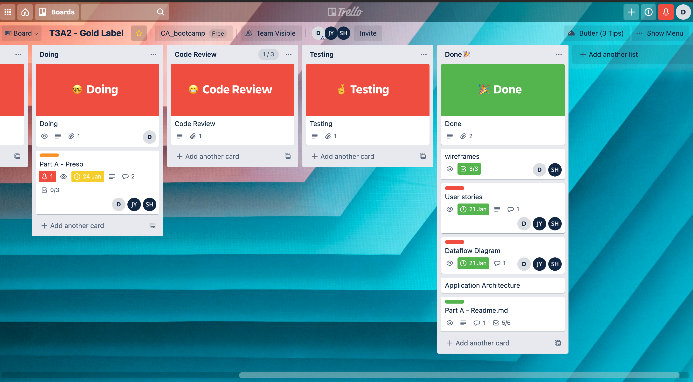

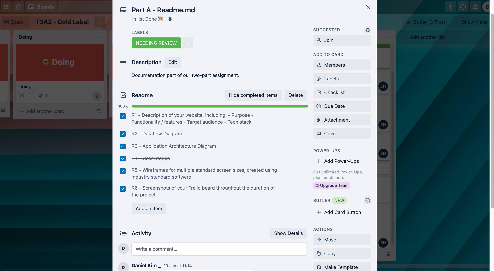

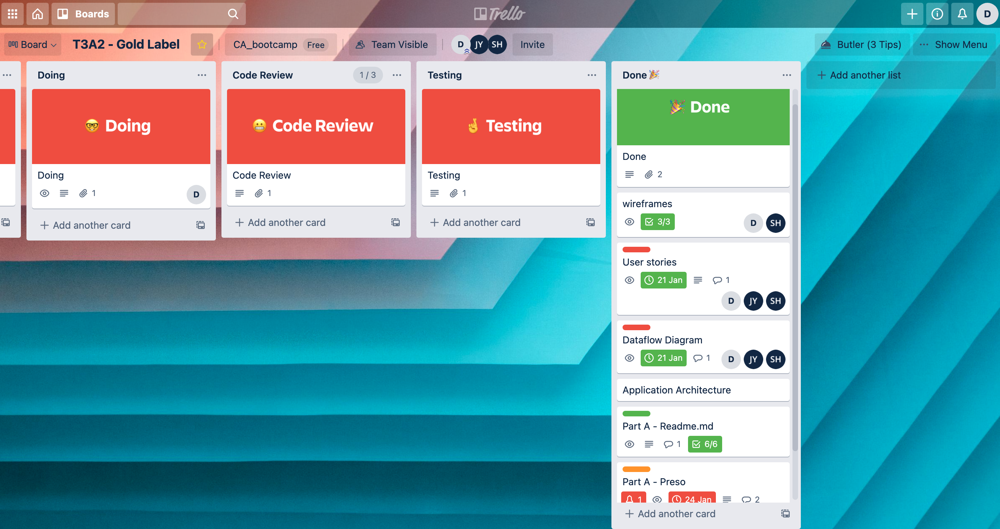